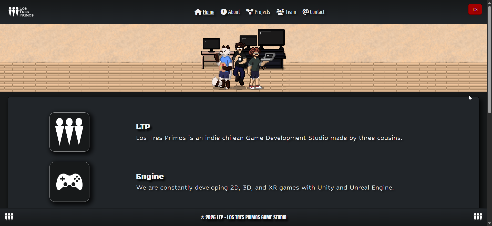

# Los Tres Primos — Indie GameDev Studio Website

Official website for **Los Tres Primos**, built with **Astro** and deployed on **Vercel**.

## Live Site

[https://ltp-astro-website.vercel.app/](https://ltp-astro-website.vercel.app/)

[](https://ltp-astro-website.vercel.app/)

## Tech Stack

- **Astro 6** — static site generation (SSG)
- **React 19** — integrated via `@astrojs/react` (available for component use)
- **Bootstrap 5** — layout, grid, navbar, utility classes (via CDN)
- **Tailwind CSS 4** — utility layer via Vite plugin
- **Custom CSS/SCSS** — compiled stylesheet (`public/css/style.css`) for theming and components
- **AOS (Animate On Scroll)** — scroll-triggered animations
- **Font Awesome** — icon set (via kit CDN)
- **Google Fonts** — Anton, Playfair Display SC, Oswald, Black Ops One, Homenaje, Hubballi, Press Start 2P

## Features

- Bilingual site (`/en` and `/es`) with automatic language redirect from `/` based on browser language
- Navbar with active page highlighting and EN/ES language toggle
- Projects and Game Jam sections with itch.io game embeds
- Contact form integrated with **Formspree** (async fetch, bilingual feedback messages)
- Anti-spam protection on the contact form:
  - Honeypot field
  - Time-trap validation (3s minimum before submit)
  - Cloudflare Turnstile CAPTCHA
- SEO metadata per page: canonical URLs, Open Graph (1200×630), Twitter Cards
- `<html lang>` set dynamically per locale (`en_US` / `es_ES`)
- No-JS fallback redirect on the root page

## Pages

| Route | Description |
|---|---|
| `/` | Root redirect (detects browser language → `/en/` or `/es/`) |
| `/[lang]/` | Home — studio intro + itch.io game embeds |
| `/[lang]/about/` | About — studio background and mission |
| `/[lang]/projects/` | Projects — games and game jam entries |
| `/[lang]/team/` | Team — meet the three cousins |
| `/[lang]/contact/` | Contact — form with anti-spam protection |

## Project Structure

```
src/
├── layouts/
│   └── BaseLayout.astro     # Global layout: head, SEO metadata, navbar, footer
├── components/
│   └── Navbar.astro         # Sticky navbar with language switcher
├── pages/
│   ├── index.astro          # Root redirect page
│   └── [lang]/
│       ├── index.astro      # Home
│       ├── about.astro      # About
│       ├── projects.astro   # Projects & Game Jam
│       ├── team.astro       # Team
│       └── contact.astro    # Contact form
└── styles/
    └── global.css           # Tailwind + AOS imports, nav overrides

public/
├── css/style.css            # Compiled custom stylesheet
└── img/                     # Static image assets
```

## Local Development

```bash
npm install
npm run dev
```

## Production Build

```bash
npm run build
npm run preview
```
